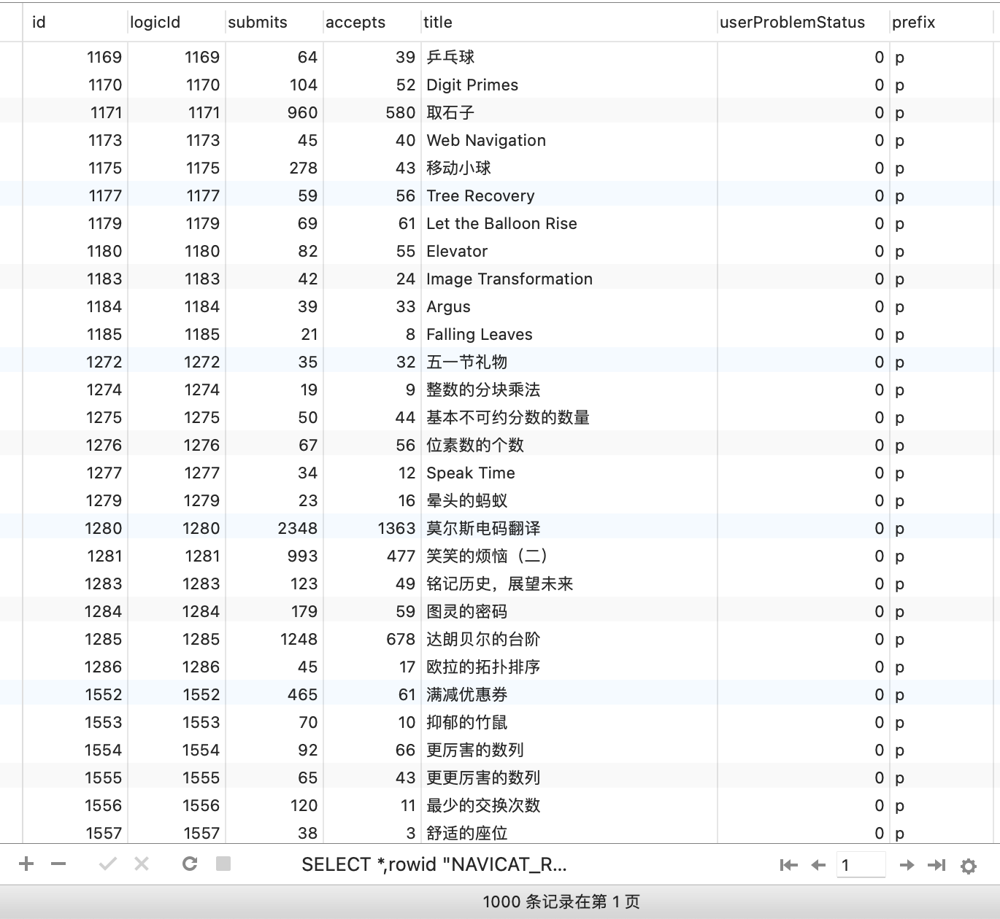
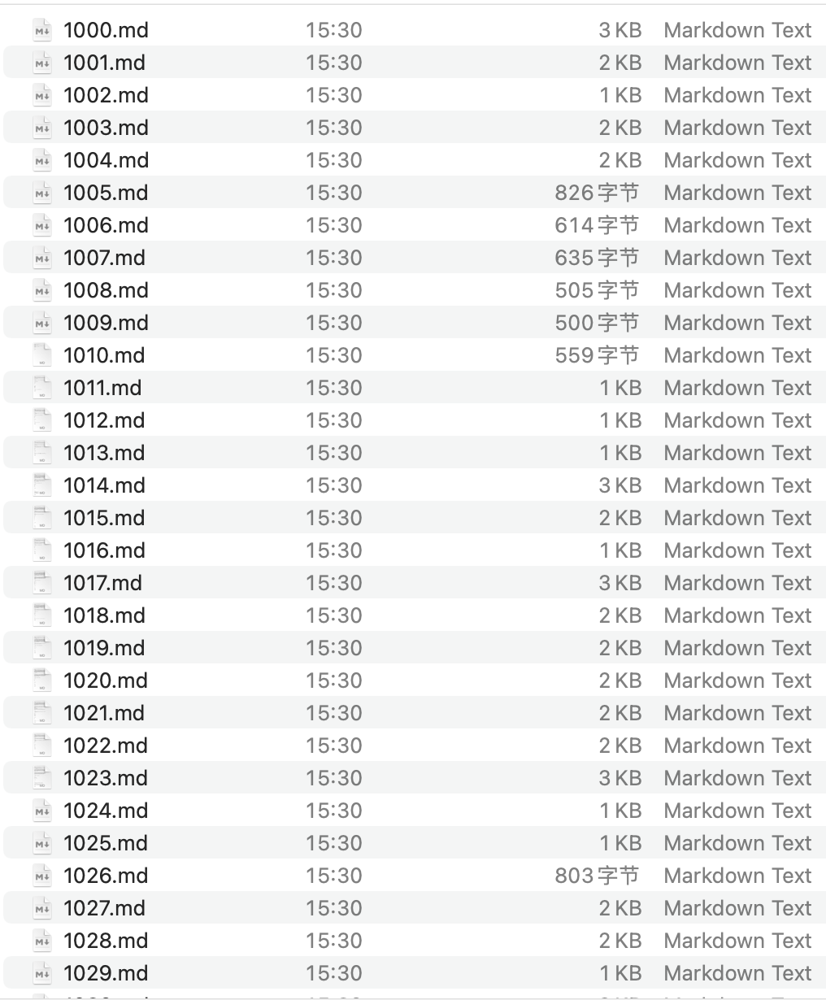
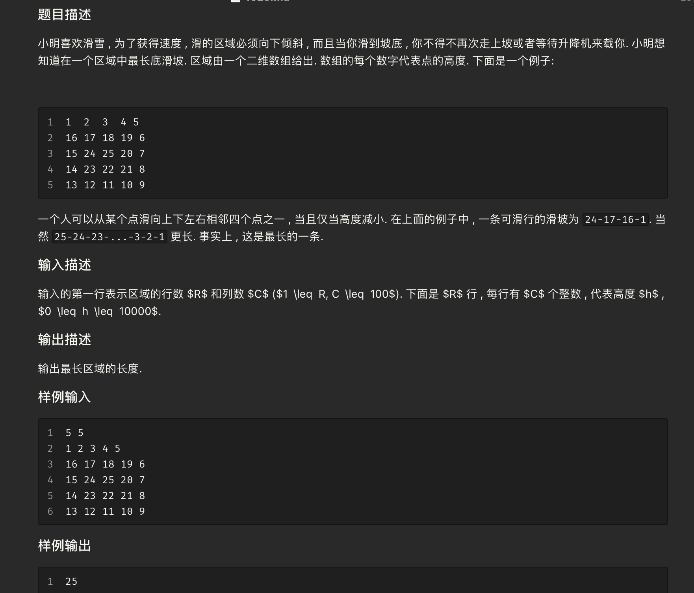

# NUIST-OJ-Crawler
## 介绍
- 爬取OJ题库，供OJ访问不畅时使用
---
## 使用
- 填写line12中的cookie
    > 获取方式：[点此](https://client.vpn.nuist.edu.cn/https/webvpn893ff9021738b0357186c0f23fc2aed6e24ca283e886022bc5d861ea12f03963/login/) 进行登陆，进入到OJ主页后F12--网络--全部--home/--请求头--Cookie

- `python3 OJ_crawler.py`
- 结果保存
> 数据保存在`details`文件夹和`sub.db`和`conclusion.txt`

---
## 效果

